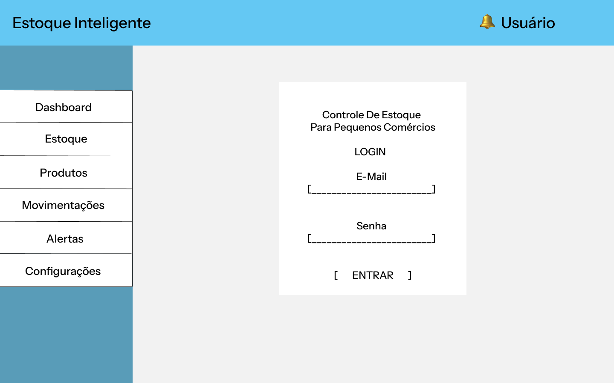
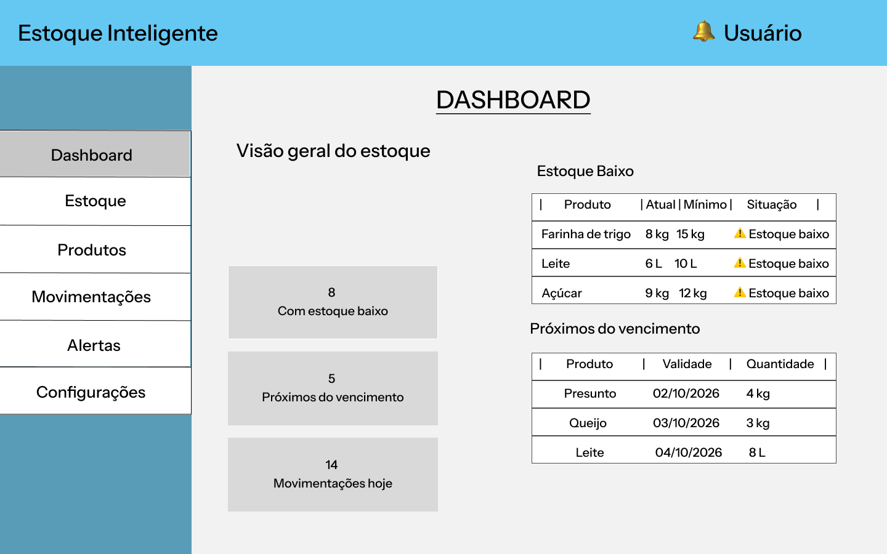
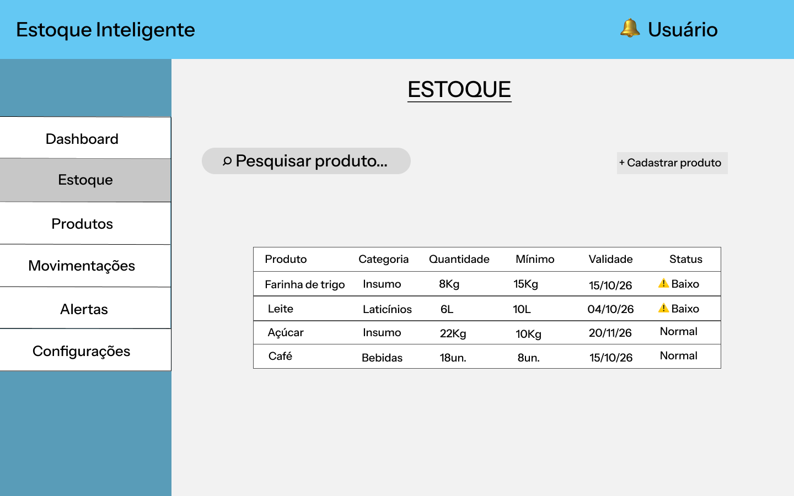
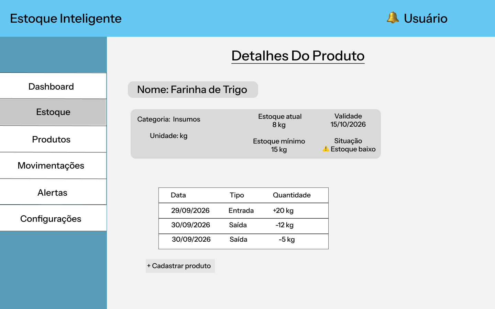
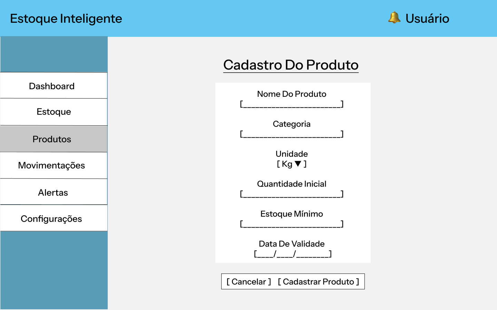
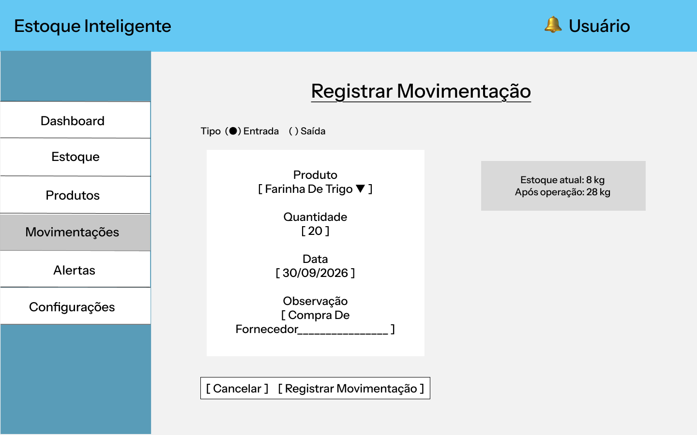
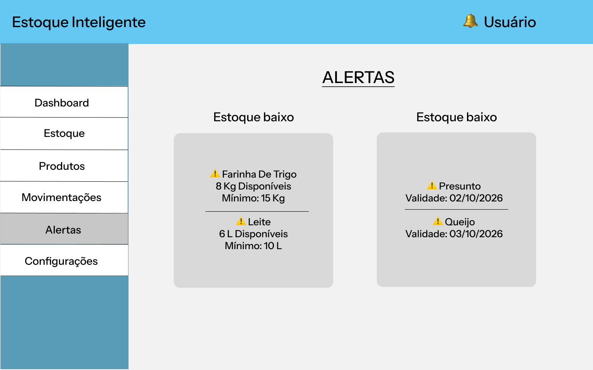

# PI-II-estoqueInteligente

Aplicação web para auxiliar na gestão e no controle de estoque de um pequeno comércio de bairro.

## Sobre o projeto

O projeto Estoque Inteligente está sendo desenvolvido no âmbito da disciplina de Projeto Integrador da Universidade Virtual do Estado de São Paulo (UNIVESP).

A proposta surgiu a partir da identificação de dificuldades relacionadas ao controle manual de produtos e insumos em um pequeno comércio, especialmente no acompanhamento de entradas, saídas, quantidades e datas de validade.

A solução proposta consiste em uma aplicação web para centralizar essas informações e auxiliar no acompanhamento do estoque.

## Objetivos

- Cadastrar produtos e insumos;
- Registrar entradas e saídas;
- Acompanhar quantidades disponíveis;
- Definir níveis mínimos de estoque;
- Identificar produtos próximos do vencimento;
- Apresentar informações para auxiliar o acompanhamento e a tomada de decisão.

## Protótipo inicial

O protótipo inicial do Estoque Inteligente foi desenvolvido no Figma
e apresenta as principais telas previstas para a aplicação.

### 1. Login

Tela inicial de acesso ao sistema.

### 2. Dashboard

Apresenta uma visão geral do estoque, incluindo indicadores,
produtos com estoque baixo e itens próximos do vencimento.

### 3. Estoque

Permite consultar os produtos cadastrados, suas quantidades,
datas de validade e situações de estoque.

### 4. Detalhes do produto

Apresenta informações específicas do produto e seu histórico
de movimentações.

### 5. Cadastro de produto

Tela destinada ao cadastro de produtos e insumos,
incluindo quantidade inicial e estoque mínimo.

### 6. Movimentação

Permite representar o registro de entradas e saídas
de produtos, com quantidade, data e observações.

### 7. Alertas

Apresenta os avisos relacionados a produtos com estoque baixo
ou próximos do vencimento.

As telas representam a solução inicial e serão utilizadas como base para as próximas etapas de desenvolvimento.

## Tecnologias previstas

- Framework web;
- JavaScript;
- Banco de dados relacional;
- API;
- Git e GitHub;
- Testes;
- Implantação em nuvem;
- Recursos de acessibilidade.

## Status do projeto

**Em desenvolvimento — etapa de prototipação.**

O protótipo inicial está sendo desenvolvido antes da implementação das funcionalidades da aplicação.

## Equipe

- Lucas Fernando Lima dos Santos
- Lucas Freitas da Silva
- Lucas Gabriel Oliveira Santos
- Lucas Pavão de Carvalho Xavier

## Instituição

Universidade Virtual do Estado de São Paulo (UNIVESP)

Projeto Integrador — 2026
